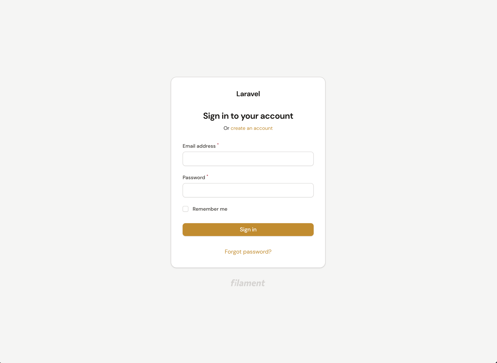
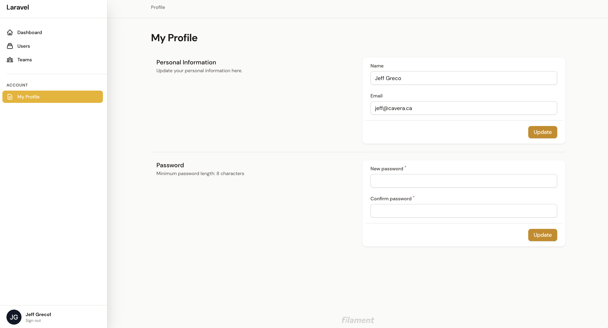
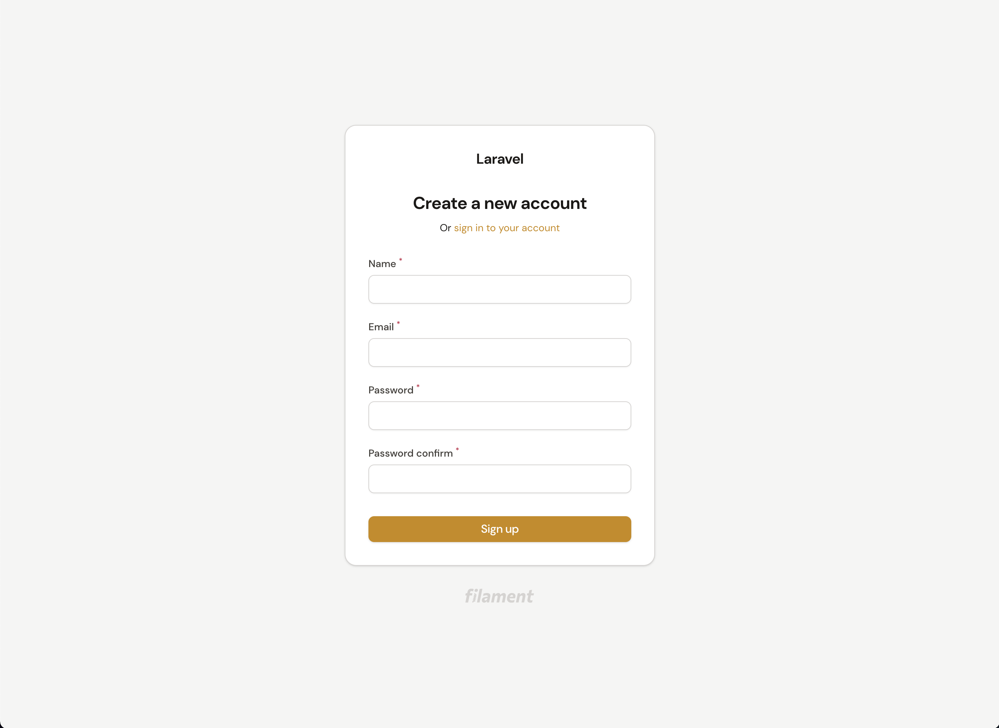
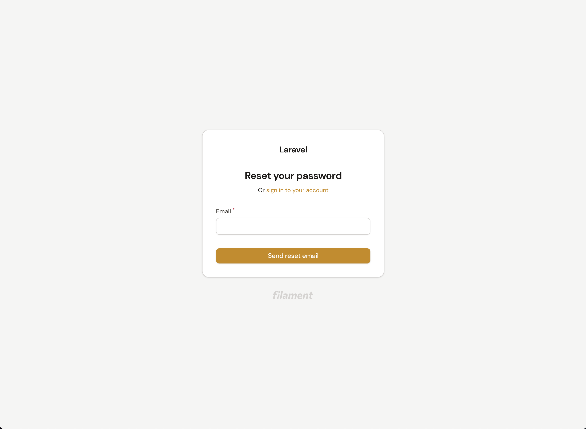

<p align="center">
    
</p>

# A custom package for Filament with login flow, profile and teams support.

[](https://packagist.org/packages/jeffgreco13/filament-breezy)
[](https://github.com/jeffgreco13/filament-breezy/actions?query=workflow%3Arun-tests+branch%3Amain)
[](https://github.com/jeffgreco13/filament-breezy/actions?query=workflow%3A"Check+%26+fix+styling"+branch%3Amain)
[](https://packagist.org/packages/jeffgreco13/filament-breezy)

The missing toolkit from Filament Admin with Breeze-like functionality. Includes login, registration, password reset, password confirmation, email verification, and a my profile page. All using the TALL-stack, all very Filament-y.

## Screenshots







## Installation

1. Install the package via composer:

```bash
composer require jeffgreco13/filament-breezy
```

2. Update the `config/filament.php` to point to the Breezy Login::class.

```php
"auth" => [
    "guard" => env("FILAMENT_AUTH_GUARD", "web"),
    "pages" => [
        "login" =>
            \JeffGreco13\FilamentBreezy\Http\Livewire\Auth\Login::class,
    ],
],
```

Optionally, you can publish the Breezy config file for further customizations, such as Password rules, redirect after registration, and enable/disable the profile page.

```bash
php artisan vendor:publish --tag="filament-breezy-config"
```

Optionally, you can publish the views using:

```bash
php artisan vendor:publish --tag="filament-breezy-views"
```

## Usage

### Email Verification

Uses the [Laravel Email Verification](https://laravel.com/docs/8.x/verification) service.
Implement `MustVerifyEmail` on your User model:

```php
use Illuminate\Contracts\Auth\MustVerifyEmail;

class User extends Authenticatable implements MustVerifyEmail
```

Then you can add the `verified` middleware to any of your routes:

```php
Route::get("/profile", function () {
    // Only verified users may access this route...
})->middleware("verified");
```

Or, force verified emails on your entire Filament Admin by adding the `EnsureEmailIsVerified` class to the auth middleware in `config/filament.php`:

```php
"middleware" => [
    "auth" => [
        Authenticate::class,
        Illuminate\Auth\Middleware\EnsureEmailIsVerified::class
    ],
    ....
```

### Extending and Overriding Components

All pages within the auth flow are full-page Livewire components made to work with Filament Forms. So you can easily extend any component to add your own fields and actions:

```php

use JeffGreco13\FilamentBreezy\Http\Livewire\Auth\Register as FilamentBreezyRegister;

class Register extends FilamentBreezyRegister
{

    protected function getFormSchema(): array
    {
        return array_merge(parent::getFormSchema(),[
            Forms\Components\Checkbox::make('consent_to_terms')->label('I consent to the terms of service and privacy policy.')->required()
        ]);
    }

    protected function getPreparedData($data): array
    {
        $preparedData = parent::getPreparedData($data);
        $preparedData['consent_to_terms'] = $data['consent_to_terms'];

        return $preparedData;
    }
...
```

### Sanctum API Tokens

The most recent version of Laravel include Sanctum, but if you don't already have the package follow the [installation instructions here](https://laravel.com/docs/8.x/sanctum#installation).

As soon as Sanctum is installed, you are ready to allow users to create new API tokens from the Profile page. Enable this option in the config:
`enable_sanctum => true`

You can then control the available permissions abilities from the config, which will add each ability as a checkbox:
`"sanctum_permissions" => ["create", "read", "update", "delete"]`

Follow the Sanctum instructions for authenticating requests as usual.

### Flash Notifications

The Breezy auth layouts use the `<x-filament::notification>` component to flash messages to the page. Flash messages in the same way as you would with `$this->notify()` but instead flash to the session:

```php
session()->flash("notify", [
    "status" => "success",
    "message" => "Check your inbox for instructions.",
]);
```

## Testing

```bash
composer test
```

## Changelog

Please see [CHANGELOG](CHANGELOG.md) for more information on what has changed recently.

## Contributing

Please see [CONTRIBUTING](.github/CONTRIBUTING.md) for details.

## Security Vulnerabilities

Please review [our security policy](../../security/policy) on how to report security vulnerabilities.

## Credits

-   [Jeff Greco](https://github.com/jeffgreco13)
-   [All Contributors](../../contributors)

## License

The MIT License (MIT). Please see [License File](LICENSE.md) for more information.
